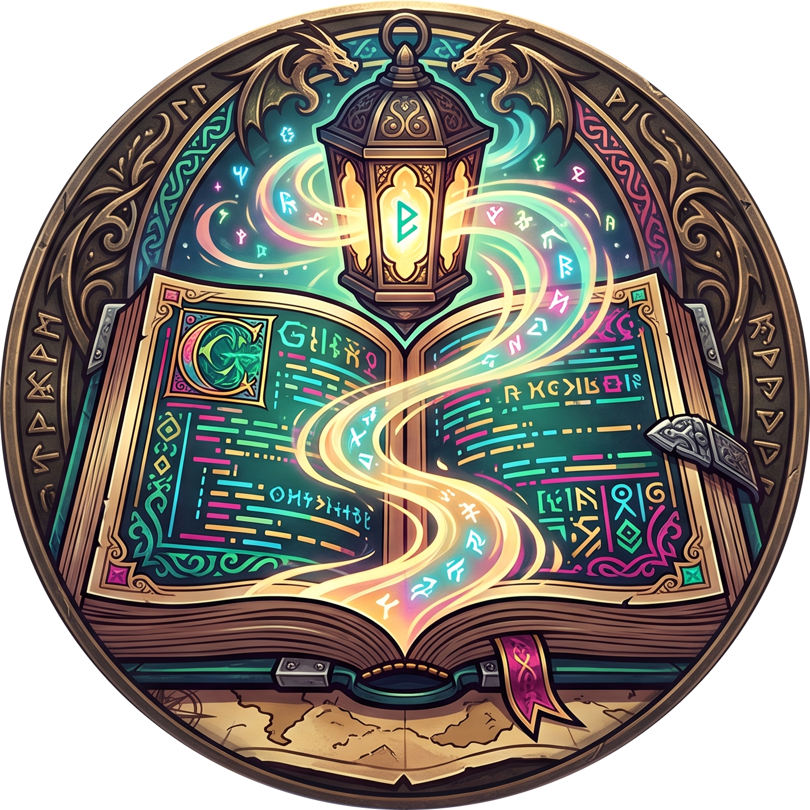
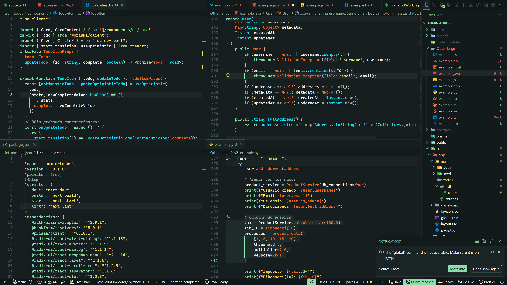
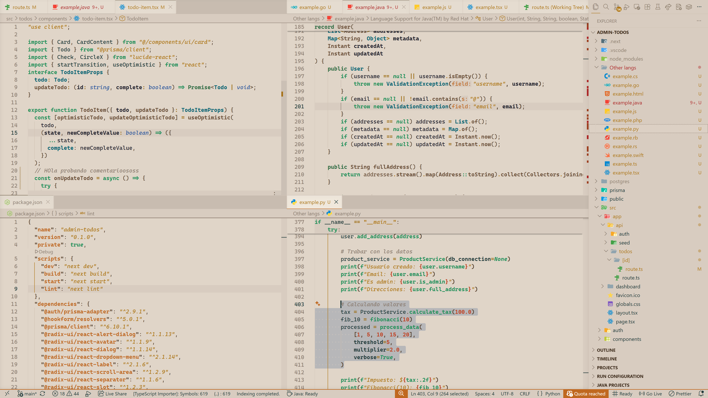
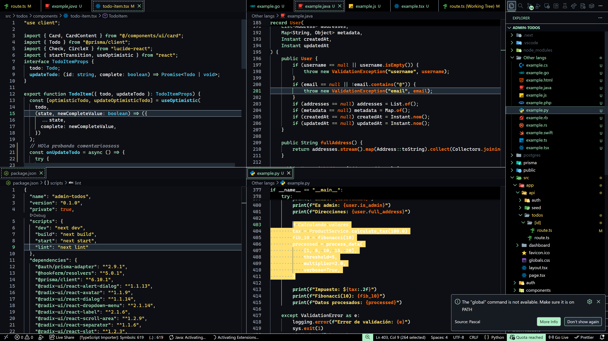
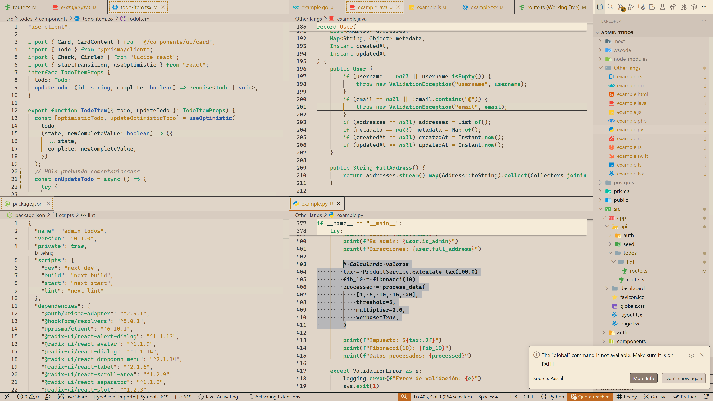

<div align="center">
  
</div>

# Venture Codex

Abre el codex. Enciende la antorcha. La aventura empieza en la línea 1.

Venture Codex es un tema de VS Code vívido creado para developers que pasan más horas dentro del editor que fuera de él. Cada keyword, cada función, cada glifo está coloreado como una página de un manuscrito iluminado: distinto, legible, hecho para habitarlo. Ya sea que estés persiguiendo un bug a las 2 a.m. o shippeando una feature un lunes por la mañana, tus ojos no deberían tener que pelear con tu código.

Cuatro variantes coordinadas comparten la misma identidad de color:

- **Venture Codex Dark** — variante principal, acentos hexádicos vívidos sobre un fondo verde-cian profundo.
- **Venture Codex Light** — fondo cálido, acentos oscuros vívidos optimizados para luz diurna.
- **Venture Codex High Contrast Dark** — compatible con WCAG-AAA, para accesibilidad y uso con proyector.
- **Venture Codex High Contrast Light** — compatible con WCAG-AAA, fondo cálido con acentos oscuros vívidos.

## Vista previa del tema

### Venture Codex Dark

<p align="center">
  
</p>

### Venture Codex Light

<p align="center">
  
</p>

### Venture Codex High Contrast Dark

<p align="center">
  
</p>

### Venture Codex High Contrast Light

<p align="center">
  
</p>

## Instalación

### Desde el Marketplace de VS Code

1. Abre **Extensiones** (`Ctrl+Shift+X` / `Cmd+Shift+X`).
2. Busca `Venture Codex`.
3. Haz clic en **Instalar**.
4. Abre la Paleta de Comandos (`Ctrl+Shift+P` / `Cmd+Shift+P`) y ejecuta **Preferences: Color Theme**.
5. Elige una de:
   - `Venture Codex Dark`
   - `Venture Codex Light`
   - `Venture Codex High Contrast Dark`
   - `Venture Codex High Contrast Light`

## Configuración recomendada

Para la mejor experiencia visual, usa una fuente con ligaduras, habilita la colorización de pares de corchetes y ajusta el cursor:

```jsonc
// settings.json
{
  "editor.fontFamily": "Cascadia Code, Fira Code, JetBrains Mono",
  "editor.fontLigatures": true,
  "editor.cursorBlinking": "smooth",
  "editor.cursorSmoothCaretAnimation": "on",
  "editor.semanticHighlighting.enabled": true,
  "editor.bracketPairColorization.enabled": true,
  "editor.bracketPairColorization.independentColorPoolPerBracketType": true,
  "editor.guides.bracketPairs": "active",
  "workbench.colorTheme": "Venture Codex Dark"
}
```

## Accesibilidad

Las cuatro variantes están ajustadas para WCAG AA o superior en los tokens de sintaxis contra sus respectivos fondos.

## Contribuir

Las contribuciones son bienvenidas. Para proponer cambios:

1. Verifica el contraste WCAG de cualquier color nuevo o modificado contra el fondo correspondiente.
2. Abre un pull request con una descripción clara y, si aplica, capturas de pantalla.

Cuando propongas cambios de color:

- Prefiere ajustar valores existentes de la paleta antes que introducir colores nuevos.
- Conserva la separación de roles entre variantes (Dark, Light, HC Dark, HC Light) para que los cuatro temas se sientan como una familia.
- Mantén este README y `CHANGELOG.md` actualizados ante cualquier cambio visible.

## Licencia

MIT — consulta [LICENSE](./LICENSE).